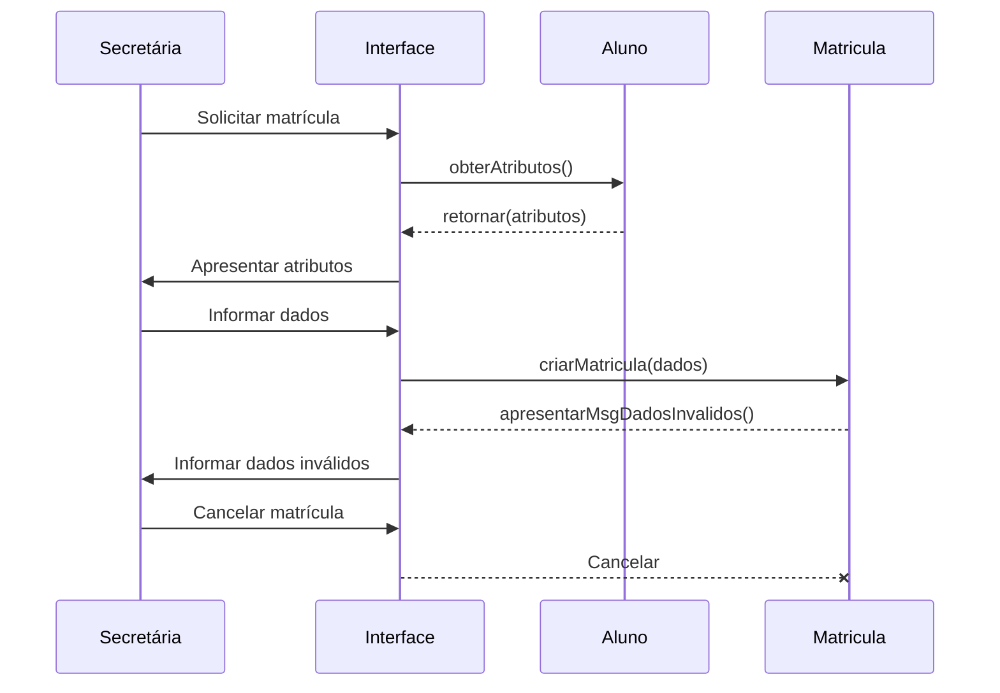

> **Elaborando diagramas com a sintaxe Mermaid**  
> Repositório: Comandos Markdown  
> GitHub: @michelelozada
&nbsp;
     
&nbsp;  
A sintaxe Mermaid permite a criação de vários tipos de diagramas para projetos que, baseados em linguagem Markdown, são renderizados no navegador.    
&nbsp;     
Os vários modelos disponíveis de fluxogramas, diagramas UML, pie charts, etc. estão disponíveis [na sua página oficial](https://mermaid-js.github.io/mermaid/#/).
&nbsp;
     
&nbsp;      
**Exemplo** - Criação de um diagrama de sequência baseado [neste exemplo aqui](https://www.qconcursos.com/questoes-de-concursos/questoes/0c70b814-09):    
##### >> Marcação para a criação do diagrama:
````

````
&nbsp; 
##### >> A renderização do código acima:
