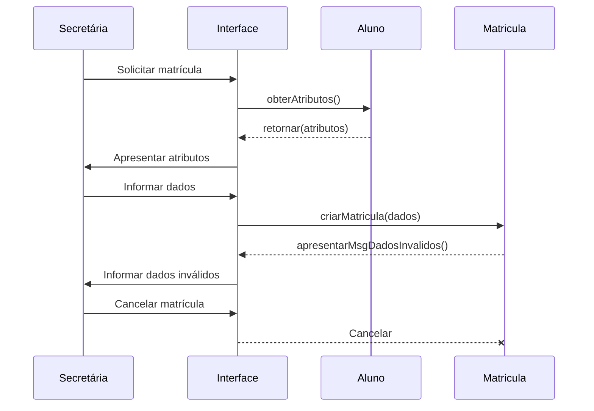
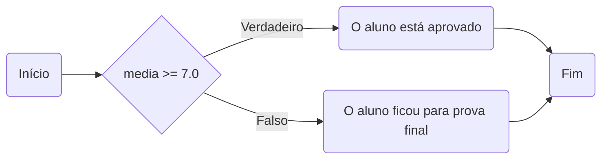
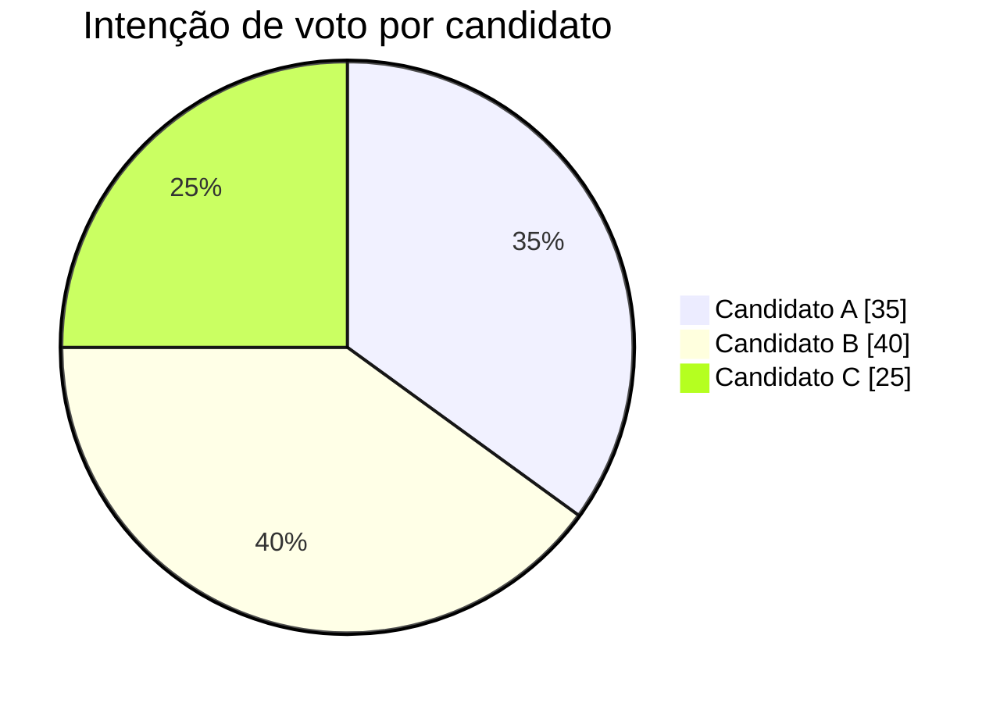

> **Elaborando diagramas com a sintaxe Mermaid**  
> Repositório: Comandos Markdown  
> GitHub: @michelelozada
&nbsp;
     
&nbsp;  
A sintaxe Mermaid permite a criação de vários tipos de diagramas para projetos que, baseados em linguagem Markdown, são renderizados no navegador.    
&nbsp;     
Os vários modelos disponíveis de fluxogramas, diagramas UML, pie charts, etc. estão disponíveis [na sua página oficial](https://mermaid-js.github.io/mermaid/#/).
&nbsp;
     
&nbsp;      
:arrow_forward: **Exemplo 1 -** Criação de um diagrama de sequência baseado [neste exemplo aqui](https://www.qconcursos.com/questoes-de-concursos/questoes/0c70b814-09):    
#### :black_medium_small_square: Marcação para a criação do diagrama:
````

````
&nbsp; 
#### :black_medium_small_square: A renderização do código acima:

&nbsp;
     
&nbsp;      
:arrow_forward: **Exemplo 2 -** Criação de um fluxograma:    
#### :black_medium_small_square: Marcação para a criação do diagrama:
````

````
#### :black_medium_small_square: A renderização do código acima:

&nbsp;
     
&nbsp;      
:arrow_forward: **Exemplo 3 -** Criação de um pie chart:    
#### :black_medium_small_square: Marcação para a criação do diagrama:
````

````
#### :black_medium_small_square: A renderização do código acima:


&nbsp;

<div align="center">
<a href="https://github.com/michelelozada/Comandos-Markdown">[Voltar à tela inicial do repositório]</a>
</div>